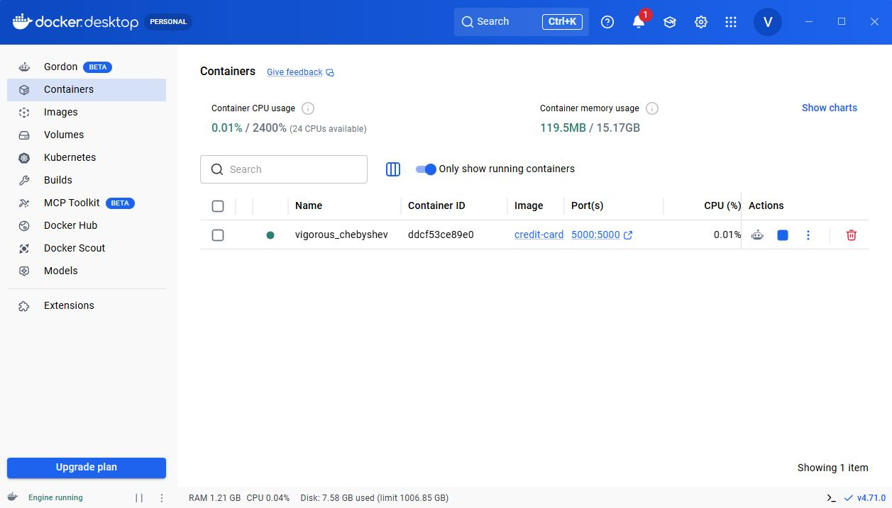
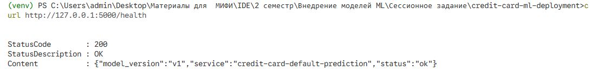
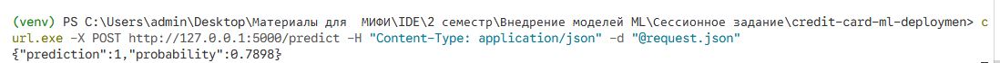

# **Разработка и внедрение сервиса прогнозирования дефолта по кредитным картам с контейнеризацией и A/B-тестированием**


## **Описание проекта**

В рамках проекта разработан сервис машинного обучения для прогнозирования дефолта по кредитным картам.


Сервис включает:

- обучение модели RandomForestClassifier;

- Flask API с эндпоинтами `/health` и `/predict`;

- Docker-контейнеризацию;

- Предложение дополнительных метрик, инструментов для масштабирования, логирования;

- План A/B-тестирования тестирование

---

## **Структура проекта**

```
credit-card-default-ab-testing/
│
├── app/
│   ├── api.py
│   ├── model_handler.py
│   └── __init__.py
│
├── data/
│   └── raw/
│       └── UCI_Credit_Card.csv
│
├── docker/
│   └── Dockerfile
│
├── models/
│   ├── model_v1.joblib
│   └── features.json
│
├── reports/
│   └── metrics_v1.json
│
├── src/
│   └── models/
│       └── train_model.py
│
├── ab_test_plan.md
├── docker-compose.yml
├── request.json
├── requirements.txt
└── README.md
```

---


## **Запуск локально**

```bash
python -m venv .venv
```

Windows PowerShell:
```powershell
.\.venv\Scripts\activate
pip install -r requirements.txt
python app/api.py
```


### **Обучение модели**

```bash
python src/models/train_model.py

```

### **Запуск API**

```bash
python -m app.api
```

Сервис будет доступен по адресу:
```text
http://localhost:5000
```
---

## **Docker**

Сборка:

```bash
docker build -f docker/Dockerfile -t credit-card-default-service .
```

Запуск:

```bash
docker pull vpetrov23ml/credit-card-default-service:v1
docker run -p 5000:5000 credit-card-default-service
```

---

## **Docker Hub**

https://hub.docker.com/r/vpetrov23ml/credit-card-default-service

---


## **Архитектура сервиса (концепт):**


### **Монолит vs микросервисы**

В рамках данного учебного проекта выбран **монолитный подход**.

Причины:

- простота реализации;

- быстрее разработка и деплой;

- нет необходимости масштабирования;


### **Концепт брокеров сообщений**

В будущем можно использовать **RabbitMQ** для:

- асинхронной обработки запросов;

- необходимости внеднения инфраструктуры с участием очереди;

- логирования
---

### **Логирование**

Для сбора и анализа логов может использоваться ELK-стек (Elasticsearch, Logstash, Kibana), который позволяет:

- мониторить работу сервиса

- анализировать поведение модели

- отслеживать ошибки

- визуализировать метрики


Также можно использовать связку Prometheus (для сбора и хранения метрик, а также для настройки системы мониторинга и оповещений ) и Grafana (для визуализации данных).

## **Оркестрация**

В рамках проекта создан файл docker-compose.yml

Запуск:

```bash
docker compose up --build
```


## **Обзор инструментов MLops (концепт)**


### **DVC**


**DVC** позволяет управлять версиями файлов и каталогов данных, промежуточными результатами и моделями ML с использованием системы Git.


### **MLflow**

**MLflow** используется для логирования экспериментов, хранения кода, данных, результатов обучения.


**## Бизнес-метрики**

- Ожидаемые финансовые потери (рассчитываются на основе вероятности дефолта и суммы кредита);

- Default Rate - отношение дефолтов к количеству одобренных кредитов.

---

## **Организация A/B-тестирования**

См. ab_test_plan.md

---

## Демонстрация работы

### Health endpoint



### Prediction endpoint



### Docker container


